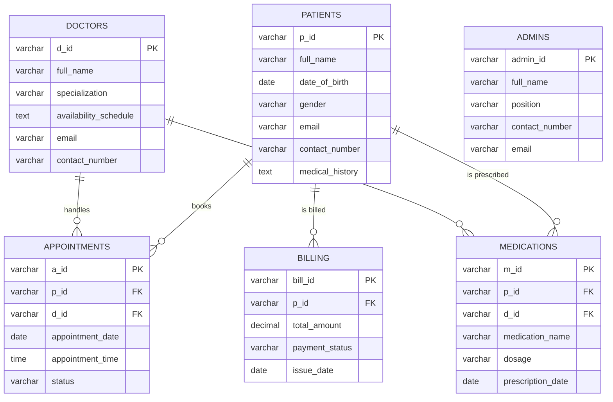

# HospitalDB
 
A small hospital management web app built for the CS340 (databases) course project. Patients book appointments and check their bills and prescriptions, doctors manage their schedule and write prescriptions, and admins manage users, billing and reports. all on top of a [Supabase](https://supabase.com) (PostgreSQL) database.
 
The app is plain HTML, CSS and JavaScript with the Supabase JS client loaded from a CDN. There is no build step and no backend: every page talks to the database directly through the query helpers in `js/sql.js`.
 
## Features
 
- **Patient** — view appointments, bills and prescriptions; book an appointment with any doctor.
- **Doctor** — view schedule; delete an appointment or change its time; create a prescription for a patient.
- **Admin** — delete a user by ID; create and delete bills; generate a report listing every table.
Login is by ID only (for example `P001`, `D001`, `AD001`) — the prefix decides the role. The registration page is a placeholder and isn't wired to the database.
 
## Database
 
Six tables. Deleting a patient cascades to their appointments, medications and bills; a doctor with appointments or prescriptions can't be deleted.
 

